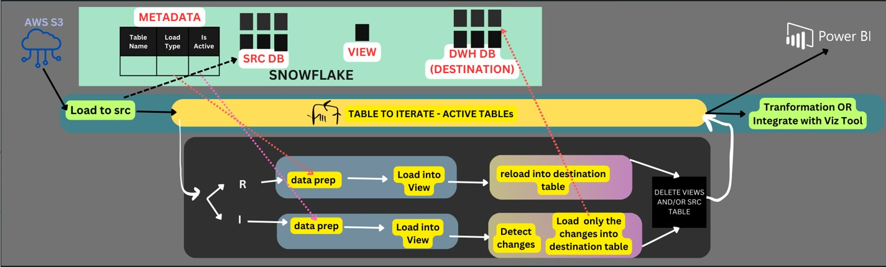
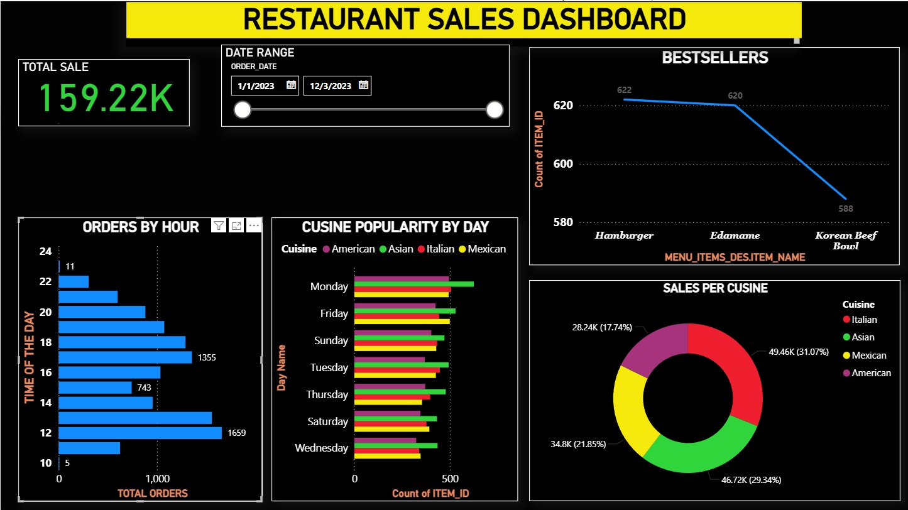

# 🍽️ Plate2Profit – Restaurant Sales Analytics Platform

An **end-to-end Snowflake–Matillion restaurant sales analytics project** built using **Matillion ETL for Snowflake** and a **metadata-driven Medallion Architecture (Bronze → Silver → Gold)**.

Matillion acts as the **core orchestration and ELT layer**, controlling ingestion, transformation, and loading based on metadata, while Snowflake serves as the scalable cloud data warehouse. The final **Gold layer** powers interactive dashboards in **Power BI**.

---

## 📌 Project Objective

The goal of **Plate2Profit** is to:

* Build a **scalable and reusable data pipeline** for restaurant sales data
* Implement **full load and incremental load** using metadata-driven logic
* Apply **Medallion Architecture** best practices in Snowflake
* Enable **fast, reliable BI reporting** for restaurant performance

---

## 🏗️ High-Level Architecture (Snowflake + Matillion)



**Plate2Profit** follows a **Snowflake + Matillion ELT architecture**, where **Matillion ETL for Snowflake** acts as the primary **orchestration, control, and transformation layer** implementing a **metadata-driven Medallion design**.

**Data Flow Overview**:

1. **AWS S3** – Raw restaurant sales data landing zone
2. **Snowflake (SRC DB)** – Raw source tables loaded from S3
3. **Matillion ETL** – Orchestrates pipelines, reads metadata, iterates active tables
4. **Metadata Table (Snowflake)** – Controls load type (Full / Incremental) & table activation
5. **Matillion Data Prep Jobs** – Apply transformations for Bronze → Silver → Gold
6. **Snowflake Views** – Semantic layer generated by Matillion
7. **Snowflake DWH (Destination DB)** – Curated Gold tables
8. **Power BI** – Reporting & visualization

---

## 🥉🥈🥇 Medallion Architecture Implementation (Driven by Matillion)

### 🥉 Bronze Layer (Raw Data – Matillion Ingestion)

* Raw data ingested from **AWS S3** into Snowflake
* Minimal transformations
* Maintains historical data
* Acts as the **source of truth**

**Examples**:

* `raw_orders`
* `raw_order_items`
* `raw_payments`

---

### 🥈 Silver Layer (Data Prep – Matillion Transformations)

* Data cleansing and standardization
* Data type corrections
* Null handling & deduplication
* Business-friendly column naming

**Examples**:

* `clean_orders`
* `clean_customers`
* `clean_products`

---

### 🥇 Gold Layer (DWH – Matillion Load Jobs)

* Aggregated and analytics-ready tables
* Business KPIs & metrics
* Optimized for BI tools

**Examples**:

* `daily_sales_summary`
* `restaurant_performance`
* `top_selling_items`

---

## 🧠 Metadata-Driven Design (Matillion-Controlled)

A central **METADATA table** controls the pipeline execution:

| Column Name      | Description                            |
| ---------------- | -------------------------------------- |
| table_name       | Source table name                      |
| load_type        | FULL / INCREMENTAL                     |
| is_active        | Whether table participates in pipeline |
| primary_key      | Used for change detection              |
| watermark_column | Used for incremental load              |

**Benefits**:

* No hardcoding of tables
* Easy onboarding of new datasets
* Pipeline controlled via data, not code

---

## 🔄 Load Strategy (Matillion-Controlled)

### 🔁 Full Load (R – Matillion Full Reload)

* Truncate & reload destination table
* Used for small or reference tables
* Steps:

  1. Data Prep
  2. Load into View
  3. Reload destination table

---

### ➕ Incremental Load (I – Matillion Incremental Logic)

* Detects only changed/new records
* Uses watermark or primary key
* Steps:

  1. Data Prep
  2. Load into View
  3. Detect changes
  4. Merge into destination table

---

## 🧩 Transformation Layer (Matillion ELT Jobs)

Transformations include:

* Revenue calculation
* Order-level aggregations
* Date & time normalization
* Restaurant & product mapping

Reusable **Snowflake Views** act as a semantic layer between raw data and DWH tables.

---

## 📊 BI & Reporting (Power BI)



Power BI connects directly to **Gold Layer tables** to provide:

* Daily & monthly sales trends
* Total revenue & order volume
* Top-selling menu items
* Cuisine-wise sales contribution
* Peak ordering hours & day-wise performance

**Why Power BI?**

* Fast refresh from Snowflake
* Scalable semantic modeling
* Business-friendly dashboards

---

## 🛠️ Tech Stack

* **Cloud Storage**: AWS S3
* **Data Warehouse**: Snowflake
* **ETL / Orchestration Tool**: **Matillion ETL for Snowflake**
* **Architecture**: Metadata-driven Medallion (Bronze / Silver / Gold)
* **Transformations**: ELT (SQL-based inside Snowflake via Matillion)
* **Metadata Control**: Snowflake Metadata Tables
* **Visualization**: Power BI

---

## 📁 Project Structure

```
Plate2Profit/
│
├── metadata/
│   └── table_metadata.sql
│
├── bronze/
│   └── raw_load.sql
│
├── silver/
│   └── data_prep_views.sql
│
├── gold/
│   └── dwh_tables.sql
│
├── powerbi/
│   └── RestaurantSalesDashboard.pbix
│
└── README.md
```

---

## 🚀 Key Highlights (Interview Ready)

* Metadata-driven Snowflake pipeline
* Supports **Full & Incremental loads**
* Implements **industry-standard Medallion Architecture**
* Optimized for BI consumption
* Easily extensible for new restaurant datasets

---

## 📈 Future Enhancements

* Add Snowflake Streams & Tasks
* Implement CDC using Snowflake Streams
* Orchestrate using Airflow / ADF
* Add data quality checks
* Real-time ingestion support


---

⭐ If you like this project, feel free to fork, star, and enhance it!
